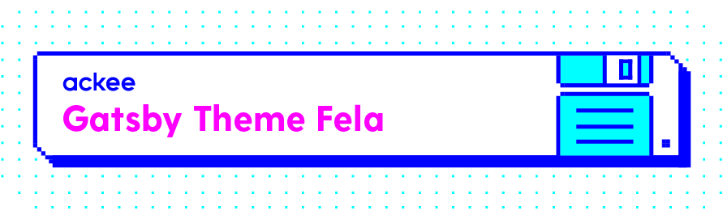

# Gatsby theme Fela

This is a Gatsby theme to extend your awesome website with Fela.

Read more about Gatsby themes: https://www.gatsbyjs.org/docs/themes/

Read more about Fela: https://fela.js.org/

## Theme

Behaves like a node_module for now its implemented using workspaces.
This theme lets you use Fela out of the box, without having to worry about implementation details.

All you have to do is to include it in your core **gatsby-config.js**

```javascript
module.exports = {
  plugins: ['gatsby-theme-fela'],
};
```

And your core workspace **package.json** file

```javascript
"dependencies": {
    "gatsby": "^2.18.22",
    "gatsby-theme-fela": "*",
    "react": "^16.12.0",
    "react-dom": "^16.12.0"
}
```

You can see example implementation in the **site** folder

## Development

Site is the example of your project that uses `gatsby-fela-theme`. Package development requires [`yarn`](https://yarnpkg.com/getting-started/install) installed.

### Running the project

Run

```sh
yarn
```

to install all dependencies and then

```sh
yarn workspace site develop
```

to start project in development mode at [`http://localhost:8000`](`http://localhost:8000`)

### Package releasing

Whenever you've done some changes in `gatsby-theme-fela` and want to relase new package version simply run `yarn release` and then provide the version you want to release

```sh
yarn release --patch # increment patch number of the version
yarn release --minor # increment minor number of the version
yarn release --major # increment major number of the version
yarn release --prepatch # create prerelease patch version
yarn release --preminor # create prerelease minor version
yarn release --premajor # create prerelease major version
yarn release # start command line prompt to let you type version manually
```

which cause several things to happen

1. Provided version is set up in `gatsby-theme-fela/package.json`
2. New release record is created in `gatsby-theme-fela/CHANGELOG.md`
3. Package changelog is opened at VS Code editor and **wait for your adjustments**
   - Keep there only package related changes and improvements
   - Repository maintenance stuff are not interesting for package users
   - When you're done, just save and close the file
   - If you don't have VS Code editor installed, release process will fail - sorry 🙁 (_we'll try to solve this in future_)
4. After you close changelog, new release commit is created and tagged with version
5. **You need to run `git push && git push --tags`**
6. Now you're work is done and it's [Travis](https://travis-ci.com/github/AckeeCZ/gatsby-theme-fela) responsiblity to new publish version
   - You can check if build and publish succeeded at [Travis page](https://travis-ci.com/github/AckeeCZ/gatsby-theme-fela)
